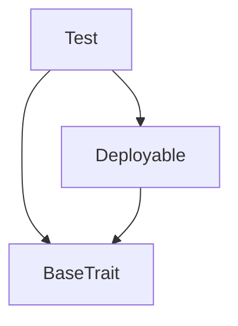
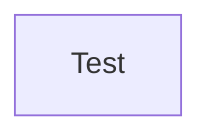

# TACT Compilation Report
Contract: Test
BOC Size: 818 bytes

# Types
Total Types: 9

## StateInit
TLB: `_ code:^cell data:^cell = StateInit`
Signature: `StateInit{code:^cell,data:^cell}`

## Context
TLB: `_ bounced:bool sender:address value:int257 raw:^slice = Context`
Signature: `Context{bounced:bool,sender:address,value:int257,raw:^slice}`

## SendParameters
TLB: `_ bounce:bool to:address value:int257 mode:int257 body:Maybe ^cell code:Maybe ^cell data:Maybe ^cell = SendParameters`
Signature: `SendParameters{bounce:bool,to:address,value:int257,mode:int257,body:Maybe ^cell,code:Maybe ^cell,data:Maybe ^cell}`

## Deploy
TLB: `deploy#946a98b6 queryId:uint64 = Deploy`
Signature: `Deploy{queryId:uint64}`

## DeployOk
TLB: `deploy_ok#aff90f57 queryId:uint64 = DeployOk`
Signature: `DeployOk{queryId:uint64}`

## FactoryDeploy
TLB: `factory_deploy#6d0ff13b queryId:uint64 cashback:address = FactoryDeploy`
Signature: `FactoryDeploy{queryId:uint64,cashback:address}`

## S
TLB: `_ a:int257 b:int257 = S`
Signature: `S{a:int257,b:int257}`

## SetIdAndData
TLB: `set_id_and_data#681868bd id:int257 data:^cell = SetIdAndData`
Signature: `SetIdAndData{id:int257,data:^cell}`

## Test$Data
TLB: `null`
Signature: `null`

# Get Methods
Total Get Methods: 9

## testGetter

## test_getter

## Test_getter

## contractData

## structAsInput
Argument: s

## messageAsInput1
Argument: m

## messageAsInput2
Argument: m

## messageAsInput3
Argument: m

## contractAsInput
Argument: test

# Error Codes
2: Stack underflow
3: Stack overflow
4: Integer overflow
5: Integer out of expected range
6: Invalid opcode
7: Type check error
8: Cell overflow
9: Cell underflow
10: Dictionary error
13: Out of gas error
32: Method ID not found
34: Action is invalid or not supported
37: Not enough TON
38: Not enough extra-currencies
128: Null reference exception
129: Invalid serialization prefix
130: Invalid incoming message
131: Constraints error
132: Access denied
133: Contract stopped
134: Invalid argument
135: Code of a contract was not found
136: Invalid address
137: Masterchain support is not enabled for this contract

# Trait Inheritance Diagram

# Contract Dependency Diagram

